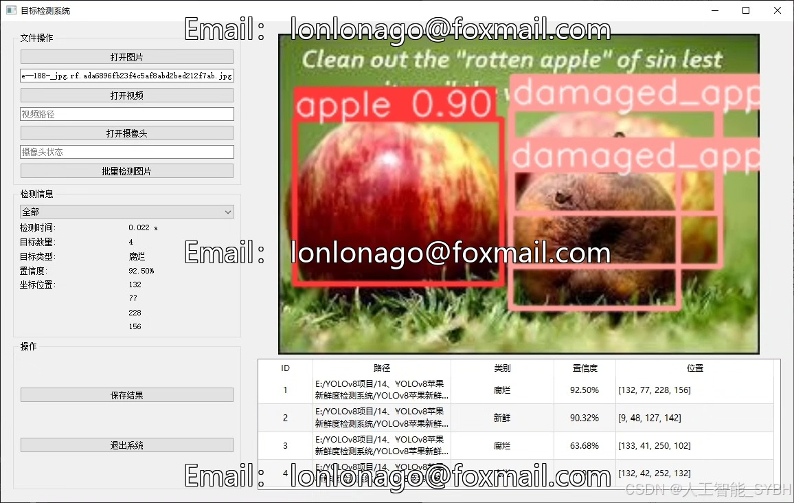
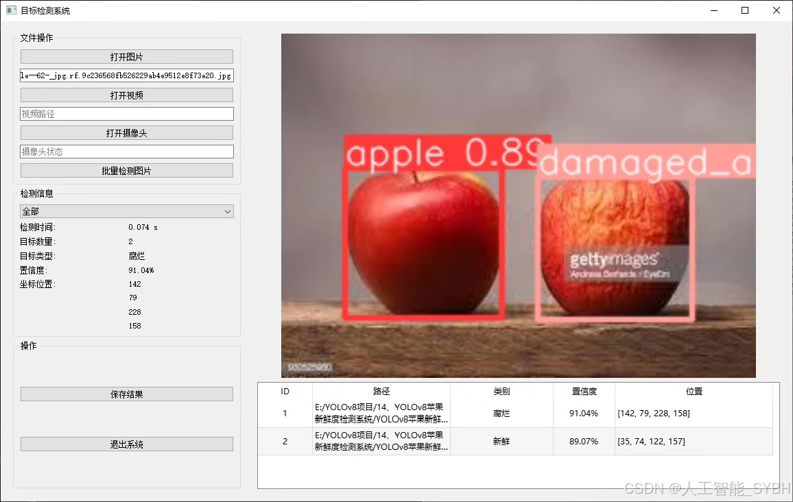
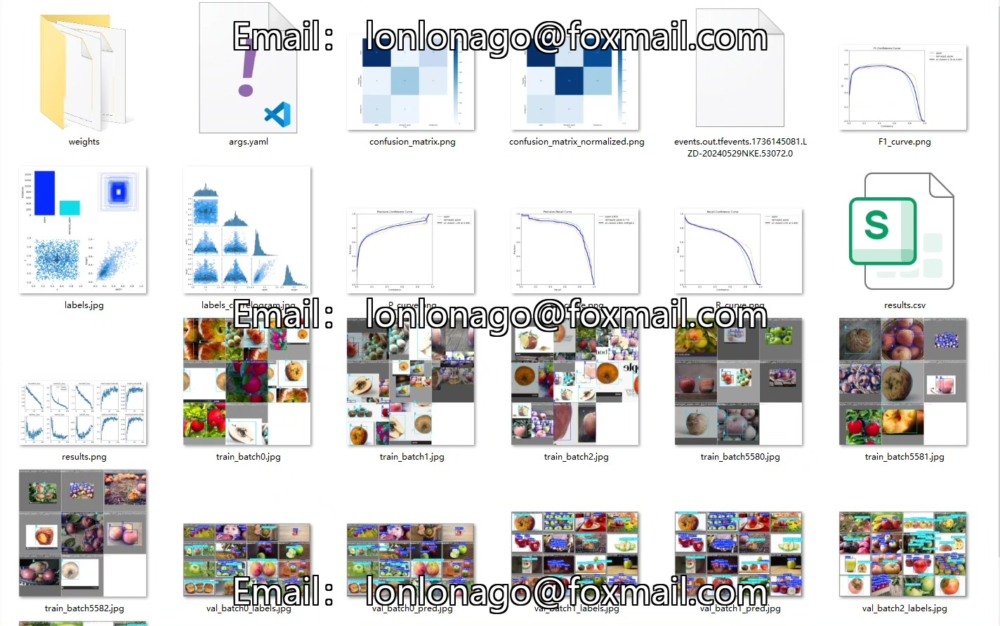
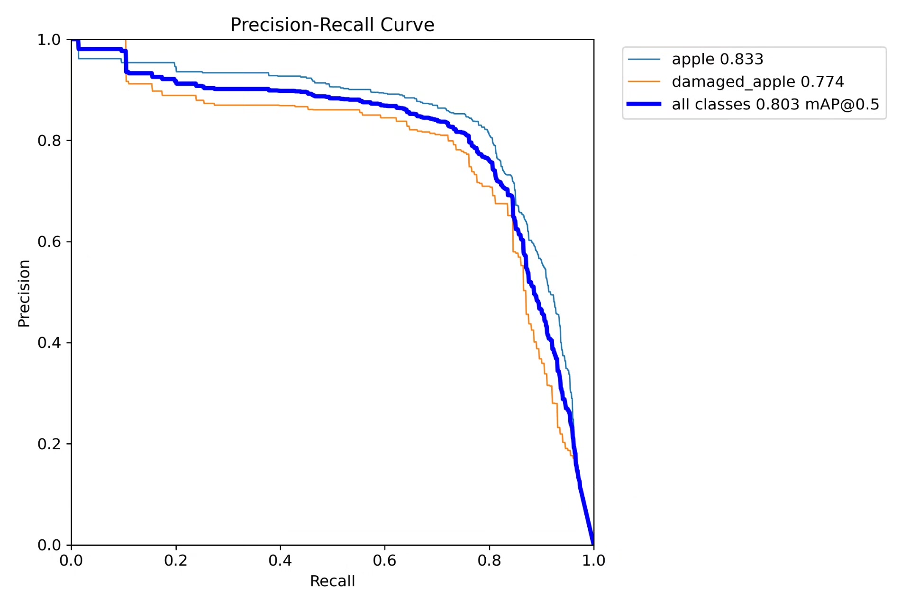
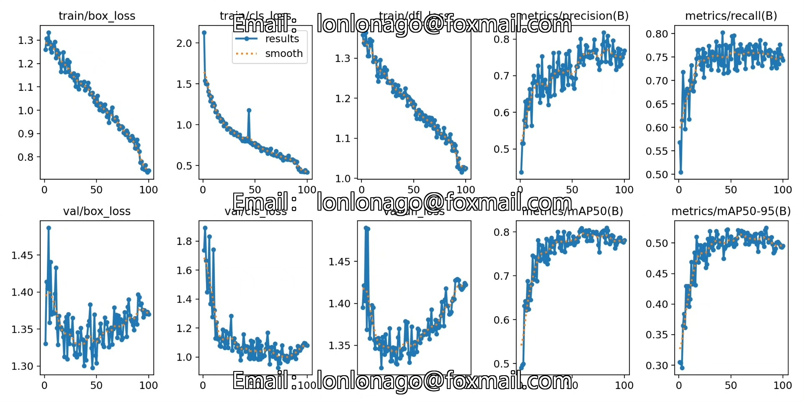
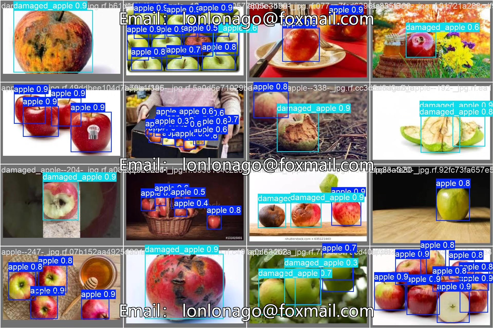
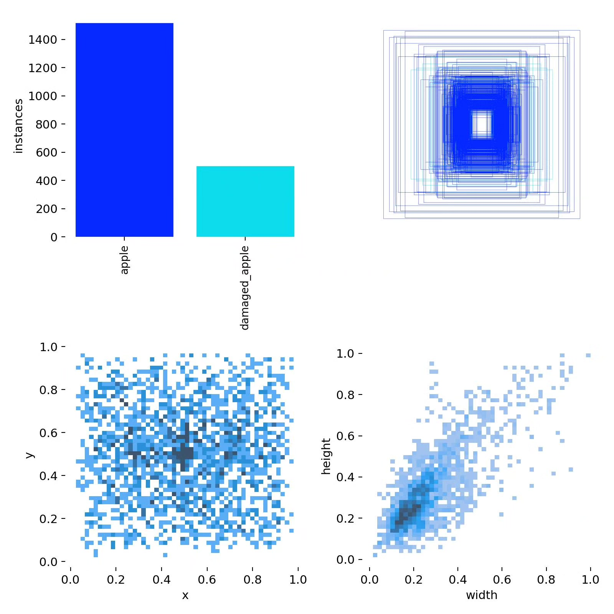
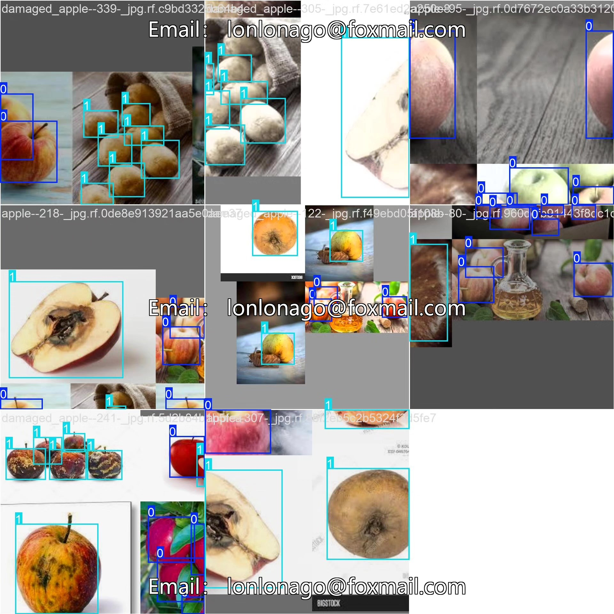

# Apple Freshness Detection System Based on YOLOv8 Deep Learning (YOLOv8+)

## Body

Based on the YOLOv8 deep learning algorithm, this project has developed a smart apple freshness detection system. It can automatically identify and classify fresh apples and damaged apples. The system uses deep learning technology to achieve rapid and objective evaluation of fruit freshness through the automatic learning and recognition of apple appearance features. The project has built a custom dataset containing 697 apple images (489 training set, 178 validation set, 30 test set), which divides apples into two categories: 'apple' (fresh apples) and 'damaged_apple' (damaged apples). After model training and optimization, the system achieved high detection accuracy on the test set, accurately recognizing freshness-related characteristics such as damage and decay on the surface of apples. This system can be applied in various scenarios such as fruit sorting lines, supermarket quality checks, and agricultural production, providing an intelligent solution for fruit quality inspection.

The company's products have obtained YOLO official commercial license certification.

We provide after-sales service.

After payment, we will provide WeChat ID for any questions.

Environment configuration: We will provide a tutorial on environment configuration, and WeChat will provide answers.

Remote installation service: If you need remote configuration, an additional fee of 69 is required, with all fees refunded if the configuration fails (only refund installation fees for old computers).

Retraining dataset: After setting up the environment, you can train on your own computer. If you need us to retrain, just pay 69+ computing power fees (2.5 yuan/hour).

Full after-sales service

## Images

## Payment

Here is a pay link on Stripe ( https://buy.stripe.com/3cs8yP7sY87d0vu9AB ). Please contact me lonlonago@foxmail.com after funding $89, and I will send you a complete data files , thank you!

